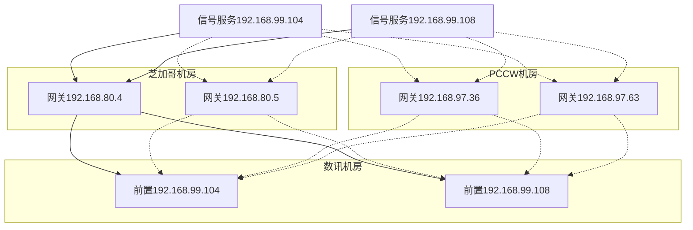

```mermaid
graph TD
A1[信号服务192.168.99.104] --> B1[网关192.168.80.4]
A2[信号服务192.168.99.108]--> B1
A1-.->B2[网关192.168.80.5]
A1-.->B3[网关192.168.97.36]
A1-.->B4[网关192.168.97.63]
A2-.->B2
A2-.->B3
A2-.->B4
B1 -->C1[前置192.168.99.104]
B1 --> C2[前置192.168.99.108]
B2-.->C1
B3-.->C1
B4 -.-> C1
B2-.->C2
B3-.->C2
B4-.->C2
subgraph 芝加哥机房
    B1
    B2
end
subgraph PCCW机房
    B3
    B4
end 
subgraph 数讯机房
    C1
    C2
end 
```

